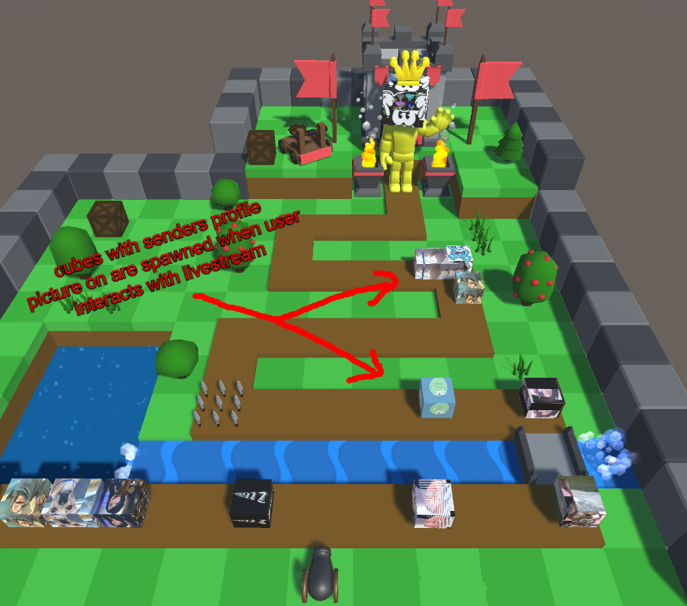

# TikTok-Live-Interactive-Program-Unity
### Interactive Livestream Program - Unity

Algorithm which connects unity project and almost any TikTok livestream using TikTok's API. The unity project reacts to livestream interactions in real time such as: 

- Likes
- Comments
- Follows
- Donations/Gifts

*Screenshot of unity program interacting with livestream. Users have incentive to engage with the livestream (liking, following) as they will appear on the program and in this particular instance, avoid obstacles to become the 'king'*

Built using library: https://github.com/frankvHoof93/TikTokLiveSharp - for API connection
- Scripted in C# in Visual Studio
